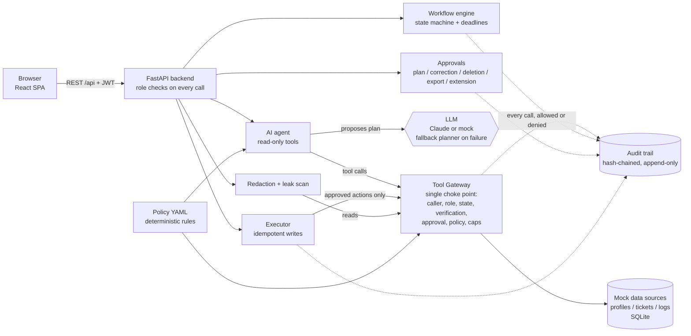
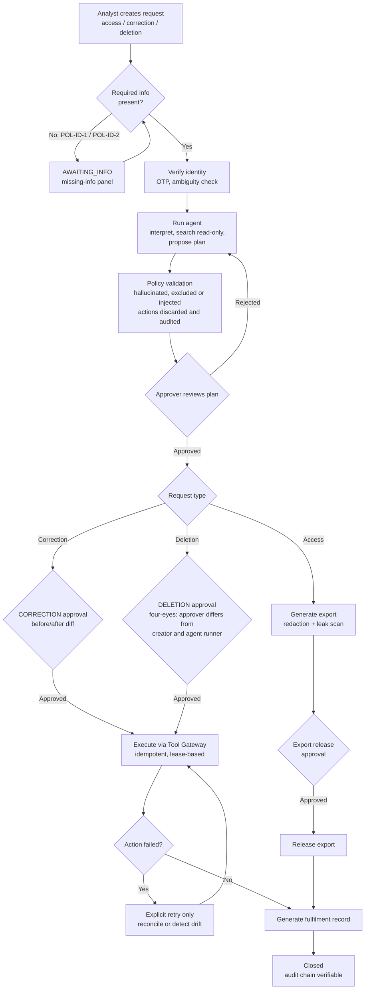

# Data Privacy Request Fulfilment Workbench

> *This tool supports internal handling of privacy requests according to the supplied organizational policy (mock "Acme Privacy Request Handling Policy v1.0"). It is an information-management and workflow aid. It does not provide legal advice and does not determine, certify, or guarantee legal or regulatory compliance. All outcomes require human review.*

An internal web app where privacy staff fulfil **access**, **correction** and **deletion** requests across three mock data sources (profiles, support tickets, activity logs). An AI agent interprets each request, searches the data, and proposes a plan. **Humans approve every modifying action**, and deterministic code enforces the policy regardless of what the model says.

## Live demo

**https://aggroso-hiring-task.onrender.com/**

- Sign in with one of the [test accounts](#test-accounts-mock-seeded) below (they are also listed on the login page).
- The demo is hosted on a free tier: the first load after a period of inactivity can take **30-60 seconds** while the service wakes up.
- The demo database is **not persistent**. It resets to the seeded data whenever the service restarts, so anything you create may disappear.
- The demo runs on the **mock LLM** (no API key), which is deterministic and covers all scenarios S1-S10.

Specification: [`docs/SRS_PRD_v1.1.md`](docs/SRS_PRD_v1.1.md) &middot; Agent usage log: [`AGENT_USAGE.md`](AGENT_USAGE.md) &middot; What changed in v1.1: [`docs/GAP_REPORT.md`](docs/GAP_REPORT.md)

## System flow

### Architecture



### Request lifecycle



## Quick start

**Docker (single container, mock LLM, no key needed)**
```bash
docker compose up --build        # or: docker build -t workbench . && docker run -p 8000:8000 workbench
```
Open <http://localhost:8000>. Set `SECRET_KEY` for sessions that survive restarts (otherwise a random key is generated per run).

**Local development**
```bash
python -m venv venv && source venv/bin/activate        # Windows: .\venv\Scripts\activate
pip install -r backend/requirements.txt
cp .env.example .env
uvicorn app.main:app --app-dir backend --port 8000 --reload   # seeds the demo DB on first start

cd frontend && npm install && npm run dev                    # http://localhost:3000 (proxies /api to :8000)
```
To serve the built SPA from FastAPI instead: `cd frontend && npm run build`, then open <http://localhost:8000>.

## Test accounts (mock, seeded)

| Role | Username | Password | Can |
| --- | --- | --- | --- |
| Analyst | `alex.analyst` | `analyst_password123!` | Create requests, verify, run the agent, execute approved actions, retry, generate exports and records |
| Approver | `jordan.approver` | `approver_password123!` | Approve plans, corrections, deletions, exports, extensions; unlock verification; reset demo data |
| Approver | `morgan.approver` | `approver_password123!` | A second approver for the four-eyes demo |
| Auditor | `sam.auditor` | `auditor_password123!` | Read-only: all requests, tool calls, audit trail, hash-chain verification, sealed pre-images |

Sign in on the login page (the accounts are listed there; click one to fill the form). The avatar menu has a role switcher for quick permission tests. Roles are enforced **server-side** on every call; there is no anonymous access.

## Demo scenarios (S1-S10)

The dashboard ships with three seeded requests (S9: `REQ-2026-0001` AT RISK, `-0002` OVERDUE, `-0003` on track). **New request → scenario preset** pre-fills the rest.

| ID | Do this | You should see |
| --- | --- | --- |
| S1 | `REQ-2026-0003` (John Doe, access): verify → run agent → Approver approves plan → generate export → release → generate record | Redaction diff with rule IDs, leak scan passed, immutable record |
| S2 | New request for Jane Smith with no account ID | `AWAITING_INFO`; missing-info panel cites `POL-ID-1`; "Ask agent to interpret" also lists `POL-ID-2` for deletions |
| S3 | Robert Taylor correction preset (phone) | Before/after diff; a *plan* approval does not allow execution; a separate `CORRECTION` approval does |
| S4 | Michael Brown deletion preset | `TCK-1006` (legal hold, POL-RET-1), `TCK-1007` (billing, POL-RET-2), `LOG-1039` (security audit, POL-RET-3) excluded; the logs are anonymised, not deleted; overriding the exclusions is refused |
| S5 | Toggle **Fault Sim: ON**, execute a deletion, then **Retry** | One action fails, nothing repeats on its own; retry reconciles and succeeds; a second retry is a suppressed duplicate |
| S6 | Emily Davis access preset | Marcus Vance's name, e-mail, phone and SSN are masked in `TCK-1010`; diff shows `POL-RED-1` |
| S7 | Carlos Gomez deletion preset | The injection text in his ticket is treated as data; no extra action is created |
| S8 | Alex Green preset; in Verification submit the **name only** | `ambiguous_match`: two profiles; nothing is auto-picked |
| S9 | Dashboard | AT RISK / OVERDUE badges and filters |
| S10 | Toggle **LLM Outage: ON**, run the agent | Amber "deterministic fallback planner" banner |

Scripted versions: `python scripts/scenario_walkthrough.py` and `python scripts/concurrency_check.py` (run against a live server; the latter fires four simultaneous execute calls and shows one `200`, three `409`, no duplicate writes).

## How the safety guarantees are enforced

1. **The LLM proposes; code disposes.** The agent has read-only tools. Write tools are unreachable by the model; the Tool Gateway rejects any non-Executor caller. Every proposed action is validated against the request type, the inventory, and the policy; the rest are discarded and audited.
2. **One choke point for data.** Every read/write goes through the Tool Gateway: registered tool → caller → role → request state → verification level → (writes) approved action + valid approval + policy re-check + subject ownership → row/rate caps → log. Denied calls are logged too.
3. **Separate, bound approvals.** Plan, correction, deletion, export release and extension are different approvals. Each is bound to a hash of the exact action set, the inventory version, and a 72 h TTL; any change voids it. Deletion approvers must differ from the creator and the person who ran the agent, checked again at execution.
4. **Idempotent execution.** Deterministic key + `UNIQUE` constraint + atomic conditional claim with a lease. Duplicates return the stored result without writing; concurrent callers get `409`; failed actions are retried only on explicit request, after reading the target (reconcile or detect drift). The write and the success marker commit together.
5. **Redaction with an independent check.** Field rules, pattern rules, directory names (other profiles, support agents, staff) and cue-based names; then a separate leak scan that blocks release. LLM suggestions can only add redactions.
6. **Tamper-evident audit.** Append-only audit events, hash-chained, enforced by ORM guards **and** SQLite triggers; `GET /api/audit/verify` recomputes the chain. Pre-images are Fernet-sealed and visible only to Approver/Auditor.

## Tests

```bash
pytest backend/tests -q        # 139 tests, ~20 s
cd frontend && npx tsc --noEmit && npm run build
```
Covers SRS §16.1: deadlines, exhaustive illegal state transitions, verification (levels, OTP lock, ambiguity, agent authorization), gateway permissions, policy exclusions and override limits, approvals (scope isolation, tamper, four-eyes, expiry, inventory versioning), idempotency (double click, lease, reconcile, drift, crash-after-write), redaction golden tests and leak scan, agent validation (hallucinated/excluded/injected proposals, invalid JSON → retry → fallback, prompt minimisation), audit tamper detection and append-only guards, fulfilment record, and API contract (standard error body, role matrix).

## Configuration

See [`.env.example`](.env.example). Highlights: `LLM_PROVIDER`/`FORCE_MOCK_LLM`/`LLM_API_KEY`/`LLM_MODEL` (real model), `SIMULATE_LLM_OUTAGE` (S10), `FAULT_INJECTION_ENABLED` (S5), `CORS_ORIGINS`, `SECRET_KEY` (production refuses the default). To use Claude: set `FORCE_MOCK_LLM=false`, `LLM_PROVIDER=anthropic`, `LLM_API_KEY=...`.

## Deployment

The app runs as a single container (FastAPI serving the built SPA on port 8000). The live demo is deployed on [Render](https://render.com) from the repository `Dockerfile`.

- Set `SECRET_KEY` to a long random string (production mode refuses the default).
- SQLite lives in `./data/app.db`. Mount a persistent volume there if you want data to survive restarts; without one the DB resets and reseeds on each start.
- Run a **single instance** only (single-process SQLite).
- Set `SHOW_TEST_ACCOUNTS=false` for anything other than a demo.

## Limitations and assumptions

- Identity verification is a mock; the one-time code appears in a simulated outbox and nothing is sent.
- Single organisation and timezone; deadlines are calendar days ending 23:59:59 UTC.
- Mock sources share the app's SQLite engine, which is what makes the write + success marker atomic. Real separate systems would need sagas/reconciliation.
- Free-text redaction is rule-based (plus optional LLM suggestions) and **not guaranteed** to catch every third-party mention; a human reviews every export.
- Pre-images are sealed but there is no automatic purge job (the "short retention" in FR-707 is documentation only).
- A description that reads as a different type than the form is **flagged**, not auto-reclassified; actions follow the form type.
- Re-running the agent after plan review starts a new inventory version; reviewer overrides are not carried over.
- The real-LLM path (Anthropic client) is implemented but was not exercised live in testing; everything automated uses the mock. The UI was type-checked and built, but not driven in a real browser in this iteration.
- Single-process SQLite is fine for a demo; use Postgres and a proper secret store for anything real.
- The policy is a fictional mock. Nothing here is legal advice.

## Project layout

```
backend/app/{api,core,agent,tools,policy,approvals,executor,redaction,audit,records,workflow,db}   backend/tests
frontend/src/{pages,tabs,components,context,api}      policy/privacy_policy_v1.yaml      prompts/v1/*.md
docs/{SRS_PRD_v1.1.md,GAP_REPORT.md}   scripts/   Dockerfile   docker-compose.yml   .env.example
```
